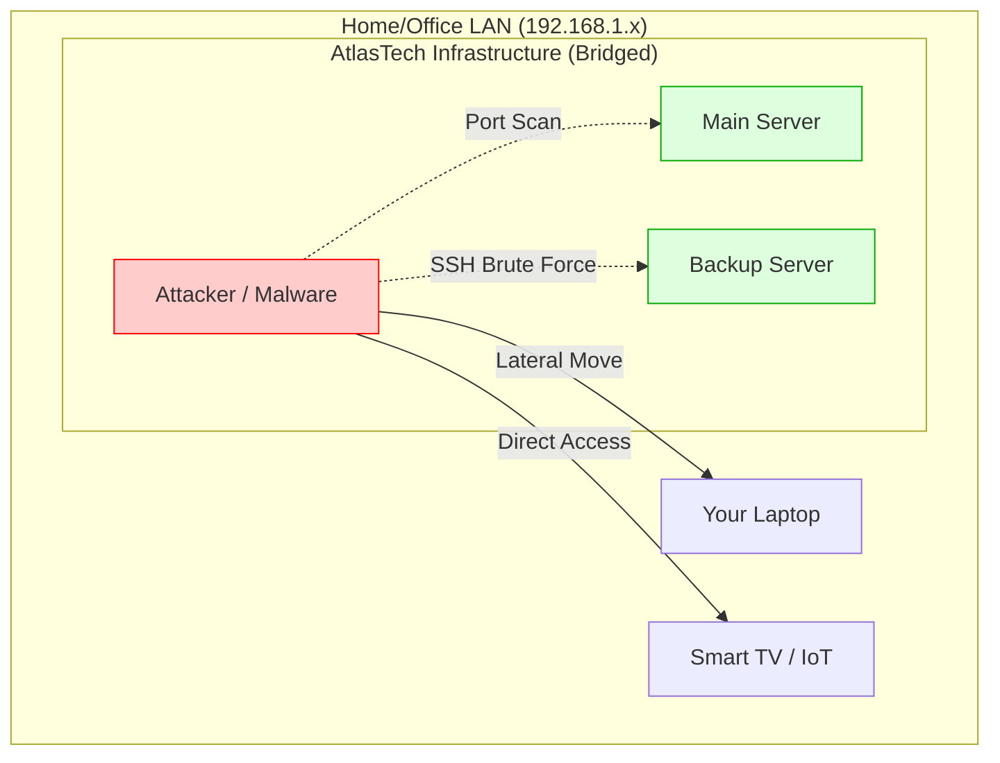
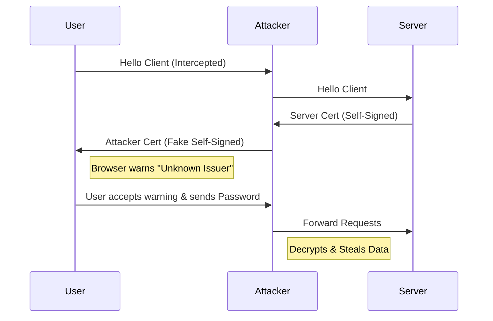

# Infrastructure Risk Analysis - AtlasTech Solutions
**Authors:** Ismail & Yassin

## 1. Introduction
This document outlines the security risks associated with the implemented infrastructure for AtlasTech Solutions. It highlights vulnerabilities introduced by configuration choices (e.g., Bridged Networking, Self-Signed Certificates) and provides visual schemas and structured tables for analysis.

## 2. Risk Overview (Matrix)

| ID | Risk Category | Vulnerability | Likelihood | Impact | Severity | Implemented Mitigation |
| :--- | :--- | :--- | :---: | :---: | :---: | :--- |
| **R1** | Network | Bridged Mode Exposure | High | High | **High** | UFW Firewall, Fail2Ban |
| **R2** | Transport | Self-Signed SSL | High | Medium | **High** | Accepted for Lab Use |
| **R3** | Database | Lateral Movement (Backup VM) | Medium | High | **Medium** | Source IP Restriction (3306) |
| **R4** | Availability | Single Host Compromise | Low | Critical | **Medium** | Off-site Backups (Manual) |
| **R5** | Code Security | Hardcoded Credentials | Medium | High | **High** | Restricted File Permissions |

### Risk Heatmap
```mermaid
XYChart-beta
    title "Risk Severity Assessment"
    x-axis [Low, Medium, High]
    y-axis "Impact" 0 --> 10
    bar [2, 6, 9]
```

## 3. Detailed Analysis & Schemas

### 3.1 Network Exposure (Bridged Mode) - R1
**Description:** Using Bridged Networking places VMs on the same physical usage network as unsecured IoT devices or personal phones.

**Attack Vector Schema:**

**Mitigation:** `hardening.sh` configures UFW to block all ports except 80/443 and restricts SSH attempts.

---

### 3.2 Transport Security (Man-in-the-Middle) - R2
**Description:** Self-signed certificates allow traffic encryption but verify no identity.

**Trust Flow Issue:**

**Mitigation:** This is a known acceptance for the lab environment. In production, use **Let's Encrypt**.

---

### 3.3 Database Integrity & Backup - R3 & R4
**Description:** If the Backup Server is infected, it could try to write malicious data to the Master DB.

**Replication Flow:**
```mermaid
flowchart LR
    A[Main DB (Master)]
    B[Backup DB (Slave)]
    C[Attacker on Backup VM]

    A -->|Replication Data| B
    C -.->|SQL Injection / Poisoning| A
    C -.->|Delete Backups| B

    style A fill:#ccffcc
    style B fill:#ffffcc
    style C fill:#ffcccc
```
**Mitigation:** Database user for replication should have **READ-ONLY** permission on the Master (except for replication logs), minimizing the risk of upstream infection.

## 4. Conclusion
While the current infrastructure is functional for the project requirements, moving to production would require:
1.  **VLAN/DMZ Segmentation** (Network Layer).
2.  **Trusted CA Certificates** (Transport Layer).
3.  **Secrets Management** (Application Layer).

---
*Generated by AtlasTech Security Team (Ismail & Yassin)*
